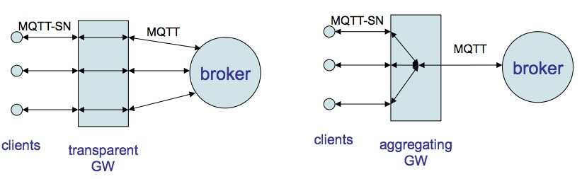

## 4. MQTT-SN架构

  

MQTT-SN的体系结构如图1所示。有三种MQTT-SN组件，MQTT-SN
客户端，MQTT-SN网关（GW）和MQTT-SN转发器。 MQTT-SN客户端使用MQTT-SN协议，通过MQTT-SN网关，将自身连接到MQTT服务器。一个 MQTT-SN网关可以集成或不集成
MQTT服务器。 在独立网关的情况下，MQTT-SN网关和MQTT服务器之间使用MQTT协议。 其主要功能是MQTT和MQTT-SN协议之间的转换。  

如果MQTT-SN客户端没有直接连接到网关所在的网络，它们也可以通过转发器访问网关。 转发器简单地封装它在无线侧接收的MQTT-SN帧，并将它们没有变化的发送到网关。 在相反的方向上，它也无变化的解封装从网关接收的帧，将它们发送给客户端。  

根据网关如何在MQTT和MQTT-SN之间执行协议转换，我们可以区分
两种类型的网关，即透传网关和聚合网关，见图2。在下面部分解释说明。 

### 4.1 透传网关

对于每个MQTT-SN客户端的连接，透传网关都将建立和维护与MQTT服务器的单独的连接。 这种MQTT连接专门用于端到端和几乎透明的客户端和服务器之间进行消息交换。 网关和服务器之间的连接数，与网关和MQTT-SN客户端之间的连接数一样多。 透传网关将执行两个协议之间的“语法”翻译。 由于MQTT-SN客户端和MQTT服务器之间的所有消息交换都是端到端的，服务器实现的所有功能和特性都可以向客户端提供。  

虽然与聚合网关相比，透明网关的实现更简单，但是它要求MQTT服务器为每个活动客户端支持单独的连接。 一些MQTT服务器的实现可能会对并发连接数有限制。  

  

### 4.2 聚合网关
聚合网关只有一个连接到MQTT服务器，而不是为每个连接的客户端建立单独的MQTT连接。 MQTT-SN客户端和聚合网关之间的所有消息交换都终止在网关。 然后网关决定将哪些信息进一步提供给服务器。 虽然它的实现比透传网关更复杂，聚合网关在有大量的SA无线传感网络的情况下可能会更有用，因为它减少了服务器必须同时支持的MQTT连接数。  
